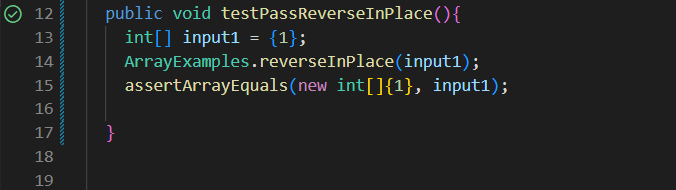
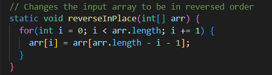

# Lab Report 2 - Servers and Bugs 
## Part 1

## Part 2
I choose to work with the buggy reverseInPlace.

~~~ java

import static org.junit.Assert.*;
import org.junit.*;
public class ArrayTests {

  @Test //This test will fail
  public void testFailReverseInPlace() {
    int[] input1 = {4, 3, 2, 1};
    ArrayExamples.reverseInPlace(input1);
    assertArrayEquals(new int[]{1,2,3,4}, input1);
	}
  
  @Test //This test will pass
  public void testPassReverseInPlace(){
    int[] input1 = {1};
    ArrayExamples.reverseInPlace(input1);
    assertArrayEquals(new int[]{1}, input1);
  }
}

~~~
Running the first test results in a failure as can be seen:

The second test on the other hand does not fail:

The symptoms of this bug seem to be that the program does not effectively reverse the array, as can be seen from the output of the first test which failed, the program only revreses the first half of the array and not the second. Below is a fix for the bug including a before and after of the code. 

**before**

**after**

![image)(after.png)

## Part 3
One of the new things I learned from lab 2 was how to start and run my own web server which was very cool and fun. I also learned about how to run a remote web server which has alot of practical applications and definitly and important skill to have. I also learned how to work with github more professionaly in lab 2 and learned how to do things such as forking files and uploading them to my own repositories.  In lab 3 I learned how to use JUnit to test certain aspects of my code, I learned a new way of approaching and dealing with a buggy program. 
