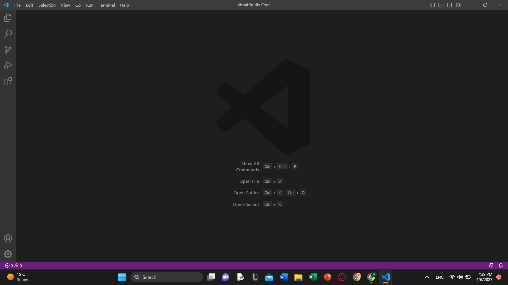
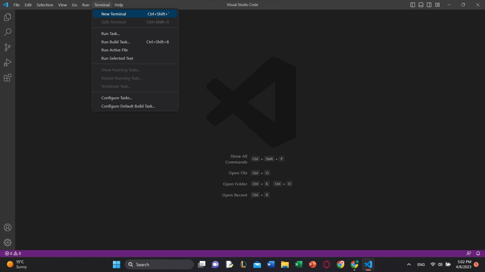
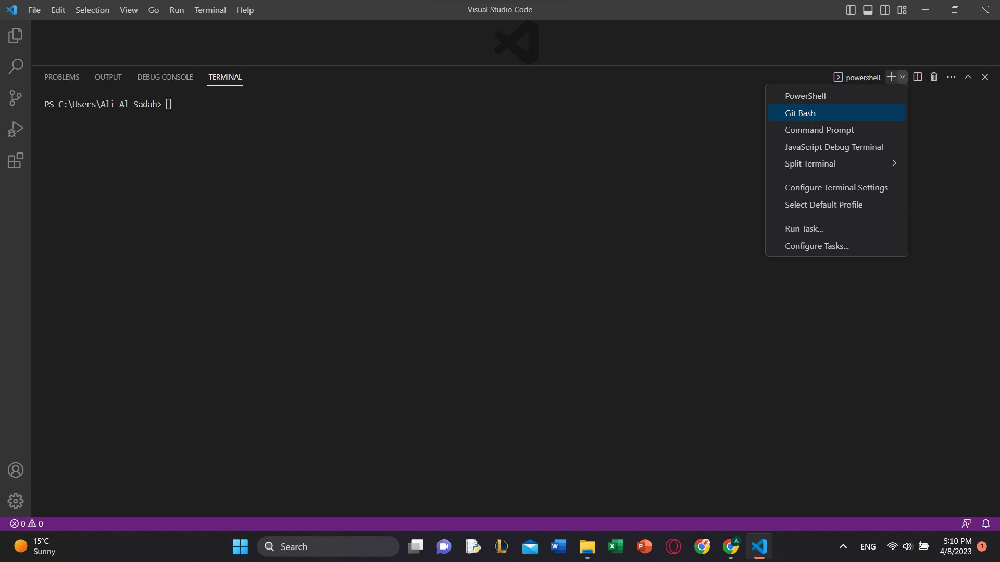
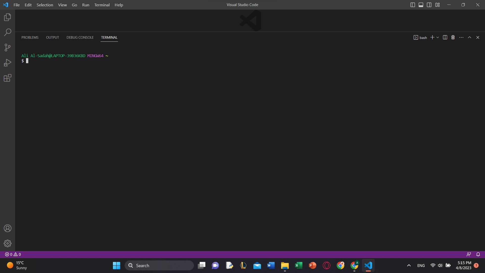
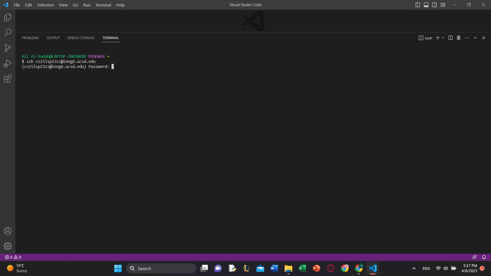
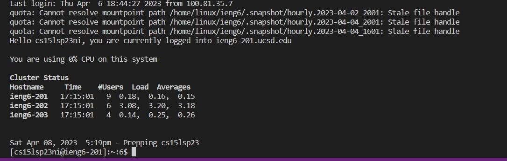

# Lab Report 1: Tutorial on how to install VS Code, and remotley connecting to the CSE remote server

**1. Installing VS Code:**
 Go to the Visual Studios Code website [Link](https://code.visualstudio.com), and follow the download process for your device. Once you are done you will be able to open a new window which should look something like this.
 
 
 **2. Connnecting to the Remote Server:**
 If you are on a Windows computer you first have to download git for Windows which you can find from this [Link](https://gitforwindows.org/), proceed to download and install it with all the default features. Once you have downloaded and installed git, open a new window in VS Code, and then click on the "new terminal" button at the top of the screen. 
 
 Once you have the terminal open click on the small arrow and select Git Bash.
 
 The Git Bash terminal should look like this:
 
 Proceed to type in
 ~~~
 ssh cs15lsp23zz@ieng.ucsd.edu
 ~~~
 but using your own unique lab username from your cse15l account. And then type in the password you set for yourself. 
 
 The terminal will ask for your password, so type it into the terminal, upon typing in the correct password you will get the following screen. 
 
 Great! you have succesfully remotley accessed the server!
 
 **3. Typing in some commands:**
 Once you are in take the time to try some commands in the terminal. Some of the commands you can try include:
 ~~~
 - cd :this command stands for change directory, it changes the current directory into the path you type in after
 - ls :this command stands for list, and it lists all the files in the current directory.
 - pwd :this commands prints the current working directory
 - cp :this command copies a file to a specific directory
 - cat /home/linux/ieng6/cs15lsp23/public/hello.txt :this command will concatenate the file hello.txt
 - exit :this command exists the ssh
 ~~~
 Here are some of these commands being used:
 
 
  
 
 
