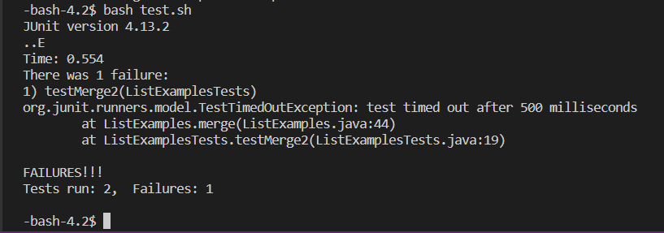

# Lab 4: Using ```vim``` and git commands

**Step 4:** I first logged into my ieng6 account using the ```ssh cs15lsp23ni@ieng6.ucsd.edu``` command then pressed ```<enter>```.


**Step 5:** I then cloned the git repository using the typing the command: ```git clone https://github.com/aalsadah/lab7.git``` and then I pressed ```<enter>```. 


**Step 6:** I type the command ```cd lab7/``` followed by the key press ```<enter>``` to navigate to the lab7 folder where I type the command ```bash test.sh``` followed by keypress ```<enter>``` to run the tests and demonstrates that they fail.



**Step 7:** I type the command ```vim ListExamples.java``` followed by the key ```<enter>``` so that I can edit the bugged java file. I pressed ```<43><J>``` , and ```<11><L>``` to navigate to where the error was. I am now at the start of the word ```index1```, so now I type the command ```dw``` to delete that word and then I press the key ```<I>``` to enter insert mode. Once in insert mode I type the correct code which is ```index2```, I then press the ```<esc>``` key to return to normal mode. I then type ```:wq``` then press ```<enter>``` to exit and save the file. 


**Step 8:** I type in the command ```bash test.sh``` and press ```<enter>``` to test the file, the tests succeed. 


**Step 9:** Finally I type the command ``` git add ListExamples.java``` then press ```<enter>```  then the command ```git commit -m "Bug in ListExamples.java has been fixed"``` then I press ```<enter>``` to commit my changes, finally to push the changes to my repository I type the command ```git push git@github.com:aalsadah/lab7.git``` and press ```<enter>``` and then I log out of ieng6 by typing the ```exit``` command and pressing ```<enter>```. 


