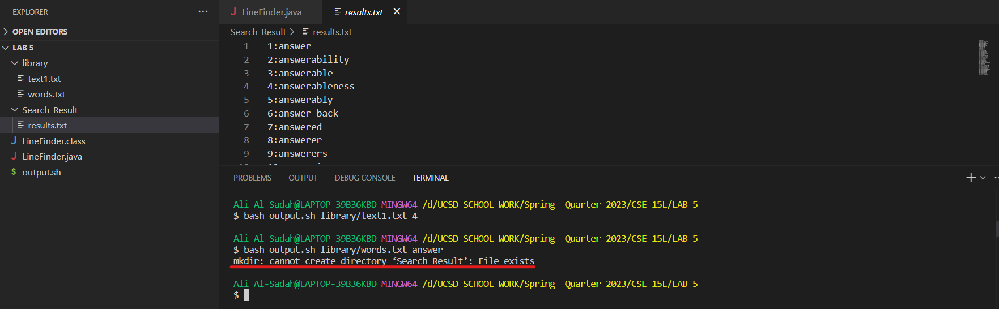

# Lab Report 5

## Part 1 - Debugging Scenario

**Student:** Hello, I am working on a java program and a bash script that is supposed to take in the path of a text file and a query, and then return the line and its number of where that query appears into a new file called ```results.txt```. I am on a Windows operating software and I am using VS code for this project. Here are some screenshots of my Java program, my Bash script, and the file structure.

```LineFinder.java```


```output.sh```


File structure and text files


I have run into two bugs so far, the first one is that for some reason my code does not return the correct line number, I want my program to return the number of where the query appears in the original file, not in the new file. The second bug is that when I run the program a second time when it already has created a directory, I get this error message which I do not want. I hope the screenshots below demonstrates what I mean. 

First bug


Second bug


**TA:** Hello, thank you for sending all these screenshots, after looking at both your Java program and Bash script, I can give you some help on how to fix the bugs. For the first bug I suggest that you look at ```LineFinder.java``` and try to catch how the lines are being counted inside of the while loop, a slight fix would make sure that you would start counting the lines the way you want your program to function. The second bug has to do with the ```output.sh``` file, can you remember any command from class that removes a directory? perhaps using that command at the start of your script could solve the bug.
**Student:** Thank you for all the help


